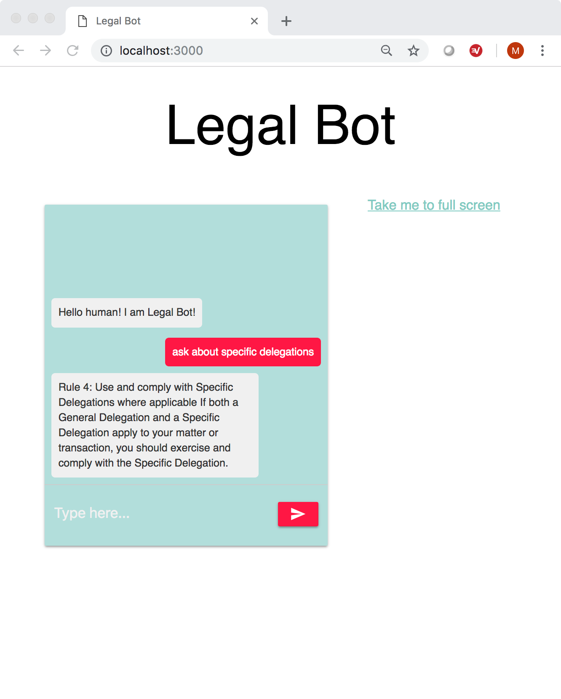

deepthought
===========

Question Answering System.

The system has the following components:

1. Uses Apache NiFi to watch for new documents to parse
2. Uses `markmo/onesource <https://github.com/markmo/onesource>`_ to process
   documents into formats suitable for input to machine learning models
3. A Deep Learning Model based on the paper `Reading Wikipedia to Answer Open-Domain Questions <https://arxiv.org/abs/1704.00051>`_
   from Facebook Research and implemented in PyTorch.
4. An API Layer to call the model via HTTP
5. A Bot Orchestration Layer to handle interactions with the user interface (UI)

.. mermaid:: flowchart.mmd

Model information:

A three-layer bidirectional LSTMs with h = 128 hidden units for both paragraph and question encoding.
Spacy is used for tokenization and also generating lemma, part-of-speech, and named entity tags. The
model has been pre-trained on the SQuAD dataset.

Example Use Case:

Answering questions given policy documents in Word and PDF format.